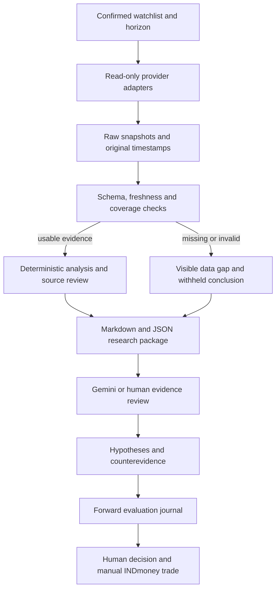

# Research-to-execution plan

> Historical plan from 2026-09-10, superseded for future development on 2026-09-11. Read [confirmed requirements](REQUIREMENTS_AND_ASSUMPTIONS.md), [research dossier](RESEARCH_DOSSIER.md), and [implementation blueprint](IMPLEMENTATION_BLUEPRINT.md). The new target uses Supabase PostgreSQL/private Storage, scheduled cloud research and a private Vercel dashboard. Statements below about unconfirmed horizon, local-first architecture and manual-only model processing describe the earlier plan, not current decisions. Historical prototype verification remains valid only within its original limits.

## Goal and present evidence

Build a reliable personal US-stock research advisor that helps Suvam investigate a small watchlist and evaluate decisions. Final trades are manual in INDmoney. Free-first local operation and portable Gemini research packages are confirmed requirements. Profitability must be evaluated separately from software quality.

Context inspected: PROJECT_CONTEXT.md; all 11 turns of the available "Stock Prediction Software Feasibility" conversation; the prior local "Start conversation" task. The supplied shared URL failed to fetch, so direct shared-page equivalence is unverified. The unrelated "Research Process Recommendation" task was inspected briefly and was not treated as a stock specification. No blanket claim of access to all historical chats is made.

Initial workspace: PROJECT_CONTEXT.md only; no Git repository, application or applicable ancestor AGENTS.md found. Python 3.14.0 and Node are installed. Relevant provider environment variables are absent in this execution session.

## Architecture

Version 0.1 implements collection, schema checks, storage, basic filing events and evidence export. Deterministic investment analysis, source-body review, imported AI reviews and the forecast evaluation journal remain planned.

## Delivery sequence and acceptance gates

| Milestone | Work | Completion evidence |
| --- | --- | --- |
| 0. Specification | Recover context, inspect workspace, select low-cost architecture, verify provider docs. | Saved requirements, source links, explicit unresolved choices. Done except horizon/watchlist confirmation. |
| 1. Evidence foundation | SEC recent filing metadata, optional Alpaca IEX trades, SQLite snapshots, visible failures, portable reports. | Offline tests pass; then real authenticated responses prove live schema and entitlements. Implementation present; live gate pending configuration. |
| 2. Research depth | Read material filings; normalize selected company facts with period/unit/restatement context; add a permitted news source and confirmed earnings dates. | Every material fact traces to a dated source; stale, conflicting and missing data have tested paths. |
| 3. AI review | Manual Gemini package first; structured review import with citations, counterevidence and invalidation conditions. | Reject unsupported source IDs and malformed reviews; no model instructions become executable actions. Compare sampled reviews with source documents. |
| 4. Alerts and interface | Calendar-aware freshness, price thresholds, material event updates, cooldowns, source links, local dashboard. | Replay events to test duplicates, material corrections, DST/holidays, restart recovery and delivery failures. A channel must be selected before external delivery. |
| 5. Evaluation | Define event/horizon, simple baselines, transaction and FX assumptions, time-ordered tests, append-only forecast/outcome records. | No look-ahead leakage; untouched holdout; returns, drawdown, costs, exposure and benchmark comparisons. Label historical LLM contamination. |
| 6. Forward observation | Save decisions before outcomes; compare baseline, quantitative-only and AI-assisted research. | Accumulate an adequately justified sample across market conditions; report uncertainty. Do not choose a fixed trade count as proof of profitability. |
| 7. Operational readiness | Single-instance runner, request budgets across restarts, backups, start/stop UX, data retention, optional alerts. | Rehearse outages, recovery, stale evidence and stopped-computer states. Only then consider always-on hosting if requested. |

Do not add complexity before a demonstrated need: start with one process, SQLite, standard Python and readable local reports. Add third-party packages when a milestone requires them, such as reliable exchange calendars or statistical evaluation. Do not add multi-agent research merely because multiple agents can be run; evaluate whether it improves sourced reasoning.

## Immediate decisions

- Horizon and watchlist: requested from Suvam in this task. Until answered, example tickers AAPL/MSFT/NVDA are demonstration choices only, horizon stays unconfirmed, and forecasting stays disabled.
- Budget: default zero paid API and hosting spend. No billable model calls.
- Model workflow: manual Gemini export first. Consumer subscription access is not assumed to grant application API entitlements.
- Risk/holdings, acceptable latency and alert channel: obtain before implementing dependent recommendation or notification behavior. No need to collect portfolio secrets now.
- Provider connection: user sets SEC identifying contact and Alpaca credentials locally; then run collection and record live evidence.

## Research questions that decide the implementation

1. Can available permitted data cover the chosen horizon at useful latency without recurring spend? If not, adjust scope or ask about a concrete paid option.
2. Which events and financial facts change the user's research decision? Prioritize those over collecting all possible information.
3. Does sourced AI analysis add value over a plain evidence packet and simple baseline? Evaluate disagreements and unsupported claims, not fluent wording.
4. Does a strategy improve outcomes after realistic US trading and INR/USD costs at acceptable drawdown? If unknown, keep it in research/paper observation.

## Authorization and operating boundaries

Routine local implementation, source research, reversible edits and tests are authorized by the current request. Ask only when required input changes the next step, or before purchases, billable services, external publication, sending messages or other actions outside that scope. Broker execution is excluded by the confirmed handoff.

This document is a project roadmap, not a scheduler. No agent is assumed to continue running between sessions. Each session should read the current status, finish the next actionable gate and update evidence. Do not mark a blocked live gate complete using synthetic fixtures.

## Next concrete gate

Run the collector on the user's confirmed watchlist with locally configured provider access. Inspect actual timestamps, IEX labeling, ticker identity, SEC filing URLs, cache behavior and failure states. Save the observed results without secrets. Then implement filing-content/financial-statement research and choose a news source against the actual horizon.
