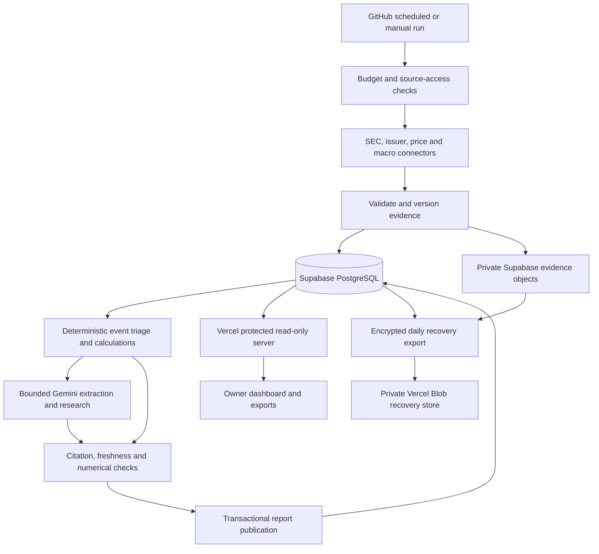

# Personal stock research advisor: implementation blueprint

Status: implementation specification, 2026-09-11. This document is ready to guide the next coding stage; its target architecture has not been implemented or deployed. Product decisions are in [requirements](REQUIREMENTS_AND_ASSUMPTIONS.md); supporting research is in [the dossier](RESEARCH_DOSSIER.md).

## 1. Architecture decision

Use Python for ingestion, deterministic analysis and research orchestration; Supabase PostgreSQL for canonical state; private Supabase Storage for permitted larger evidence objects; and Next.js/TypeScript on Vercel for the single-owner dashboard. Run bounded Python jobs in a private GitHub Actions repository. Keep one repository with a Python package and a separate web application directory.

PostgreSQL replaces the earlier SQLite-in-Blob operational proposal. Do not download, mutate and reupload an entire database on each run. Use native transactions, unique constraints and indexed queries. PostgreSQL full-text search is sufficient initially; do not add a vector database, Redis, a message broker or a multi-agent framework before a measured need.

Use a small encrypted Vercel Blob store only for off-site recovery archives, not as a second operational database. The owner's PC is optional for reading/exporting/restoring data and is never the production scheduler.

The evidence-model interface receives content and source IDs only. It never receives database credentials, storage tokens or arbitrary execution tools.

## 2. Data model and contracts

Create versioned PostgreSQL migrations using Alembic and typed SQLAlchemy models; use psycopg for Python database access. Treat the existing SQLite implementation as a legacy prototype, not as a substitute for PostgreSQL integration tests. Use UTC `timestamptz`, exact numeric types for monetary/source values, and JSONB for source-specific metadata and validated review structures.

| Entity | Required responsibility and constraints |
| --- | --- |
| Company/watchlist | Symbol, exchange/currency, issuer CIK, verified canonical IR sources, active status; separate ticker changes from issuer identity. |
| Source policy | Provider identity, feed coverage, credentials reference, storage/processing/retention eligibility, last verification and quota configuration. Store no secret values. |
| Evidence revision | Provider item ID, content hash, source URL, publication/event/first-observed times, retrieval time, revision relationship, object key and retention state. Unique source-item-content version. |
| Financial fact/price observation | Entity, value, unit, period/basis, observation and availability times, feed/adjustment semantics, evidence revision. Do not overwrite history with corrections. |
| Event | Company, type, source family, linked evidence and material revision history; syndicated copies are linked, not counted as independent confirmations. |
| Run/provider outcome | Intended slot, actual start/end, provider-specific successes/failures, watermark, request/token use and safe error code. |
| Research review/claim | Version, company, evidence IDs and passages, analysis status, facts/inferences/scenarios, contradictions, invalidation conditions and model/prompt versions. |
| Publication | Immutable review version and latest-published pointer, committed together after validation. |
| Evaluation/correction | Audit labels, rubric results, explicit later corrections and prospective observations. No silent retrospective edits. |
| Budget/lease | Period usage reservations and single-worker lease with fencing version; updates are transactional. |

Each connector returns a typed result: items, source identity, timestamps, pagination/cursor state, completeness, coverage and safe failure details. Empty-success and failure are distinct. Advance a source watermark only after all items in the acknowledged page/batch are persisted; repeat a bounded overlap window to capture late records, using idempotency keys to remove repeats.

Pydantic validates connector and model payloads. Code checks citation existence, company identity, numerical consistency and temporal eligibility. General semantic passage support requires the bounded support-review step below; schema validation alone cannot establish it, and an automated reviewer can still be wrong.

### Public-to-owner interfaces

Keep the Python commands `doctor`, `demo`, and one-shot collection concepts. Add a `research` command for bounded jobs and explicit configuration for profile, watchlist and storage. Preserve the existing prototype commands during migration. Production mode requires PostgreSQL and must never silently fall back to SQLite when a database connection fails.

The web server exposes protected read-only endpoints for system status, material events, a company review/history, evidence excerpts, and Markdown/JSON export. Use pagination for history. Source-body downloads are excluded initially; show the cited passage and original source link instead. Never expose arbitrary SQL, a generic fetch-URL endpoint or a model-execution endpoint.

Version new research JSON as schema v2. Preserve v1 examples for historical readability; mark migrated records with original schema, origin and mode. A demo response is always explicitly synthetic and cannot be published to the live dashboard.

## 3. Acquisition and research behavior

Start with one to five user-configured equities. Resolve symbol/CIK/issuer-source identity before the first run. A missing watchlist leaves live scheduling disabled. Demonstration symbols are not automatically promoted into production configuration.

Poll SEC recent submissions and retrieve changed material filings/attachments. Normalize selected XBRL facts only when unit, period, filing version and basis are clear. Fetch verified issuer announcements and events. Retrieve completed price bars with explicitly configured feed and adjustment semantics; label any IEX context separately. Refresh macro series daily and check release feeds at the normal event cadence.

Commercial news connectors remain disabled until their access, data use and cloud-model processing policy are resolved. Never scrape around a blocked endpoint. For unavailable commercial coverage, show "issuer/filing sources only" prominently. An earnings date is confirmed only with an authoritative supporting source; a calendar estimate is labelled estimated.

Source fetchers use HTTPS, explicit source/domain policy, response-size and timeout limits, safe redirect validation and no access to private/internal network addresses. Honour provider retry windows and budgets; don't let every stock independently retry a provider already known to be unavailable. Source documents are untrusted text and cannot change tool permissions.

### Specialist roles and budgets

1. Deterministic triage groups new evidence, identifies source revisions and selects relevant material changes.
2. A batched extractor identifies facts and passages from selected documents. Benchmark Flash-Lite; use deterministic parsers when reliable.
3. A synthesizer produces a company review using the validated evidence packet. Benchmark standard Gemini Flash access.
4. A mandatory support reviewer receives each proposed material factual claim and its exact cited passages, returning supported, contradicted or insufficient-support with an explanation. Omit contradicted/unsupported factual claims from the published narrative; retain flagged candidates only in the audit record. Label inference separately and link its factual premises. This is an automated quality check, not proof of correctness; human source audits remain the evaluation ground truth.
5. A challenger runs only for conflicting decision-critical facts or a material change to the previous thesis. It can request missing evidence; it cannot override validation. If it rewrites claims, the support reviewer must check those revisions within the same budget.
6. Code validates and publishes the review. If support review cannot run, publish only independently validated structured facts or clearly attributed source excerpts plus analysis-unavailable status; do not publish unchecked generated factual narrative as verified research.

Start with at most six model calls per run and eighteen per day, further reduced to the account's verified remaining quota. Extraction, synthesis, mandatory support review, optional challenge and any re-review all count toward those ceilings. Reserve enough calls for synthesis plus its support review before generating a narrative; queue additional companies when the remaining budget cannot complete both. Limit each call to a source packet of at most 12,000 input tokens and 2,000 output tokens, including the provider's applicable output budget semantics. Reserve usage before dispatch; count failed calls when the provider does. Do not enable calls until the exact free project/model limits are recorded. These are application ceilings, not claims of free entitlement.

Prioritize material corrections, new financial distress/guidance/earnings evidence, other material events, then scheduled summaries. Deferred work persists in PostgreSQL and is reconsidered on the next run. No more than one review per company per evidence version. Start without autonomous browsing loops or agent debates.

Model/prompt changes create new versions and trigger offline evaluation. Never automatically self-tune on recent winning predictions.

## 4. Scheduling, publication and partial failure

Use an hourly schedule at minute 17 from 08:00 through 18:00 America/New_York on weekdays. Add 00:17, 04:17 and 20:17 on weekdays; weekends run every four hours at minute 17. Apply exchange calendars to interpret price freshness and holiday activity; issuer/regulatory events can still occur outside trading sessions. The target is roughly 350-400 jobs/month, depending on the calendar and manual requests.

Keep one GitHub concurrency group for research, maintenance and manual refresh, with cancellation of running work disabled. Coalesce superseded pending runs. Use a database lease/fencing version to protect against another runner outside GitHub. Revalidate lease ownership when committing publication; expired workers cannot overwrite newer work.

The application budget is 150 seconds of useful work per normal run, reserving time for safe persistence within a five-minute job timeout. Use bounded HTTP/model timeouts and defer unfinished optional work. Target approximately three billed runner minutes on average; actual setup overhead must be measured. Reserve at least 20% of remaining shared runner quota for recovery and checks.

Do not hold a transaction open during provider/model calls. Commit ingested evidence in short batches. Upload source objects before making their records available as complete evidence. Publish a review and its latest pointer in one PostgreSQL transaction after checking citations and object availability. Storage and PostgreSQL do not share a transaction: failed metadata commits can leave orphaned objects, which maintenance removes only after a grace period and reference checks.

| Failure | Required behavior |
| --- | --- |
| One provider fails | Retain valid evidence from other providers; show the missing coverage and original observation dates. |
| Model quota/timeout | Publish deterministic facts and AI-unavailable status; defer optional synthesis without paid fallback. |
| Job delayed/missed | Dashboard computes overdue status from schedule and last completed run; do not require a successful new worker to reveal staleness. |
| Database paused/unreachable | Show unavailable status rather than a fresh-looking empty page; link owner recovery instructions. Never switch production to local files. |
| Contradictory evidence | Present the conflict, withhold unsupported conclusions, and route the affected claims to challenge/review. |
| Failed publication | Keep the last published review; show its original date. Retry using the run/evidence idempotency keys. |
| Revised source | Append evidence/review revisions and identify the corrected prior claim. |
| Retention expired | Preserve permitted metadata/hash and mark source body expired; do not imply it remains replayable. |

Expose coverage, source freshness, scheduling status, AI-analysis status and forecast-validation status separately. A valid research note can have incomplete market coverage; an old note is not current merely because the dashboard loads.

## 5. Security and database access

Create one Supabase Free project and private evidence buckets at the later setup stage. Keep application tables in an unexposed schema; disable the Data API when SQL-only access is used. Revoke anonymous/authenticated API-role access. Where any table is exposed, require RLS and tests proving the expected access boundary. RLS alone does not protect against a role that bypasses it.

Use separate PostgreSQL roles: migration owner for explicit migrations, limited ingestion/research writer for jobs, and read-only dashboard role. The dashboard can read published review views, status and cited excerpts; it cannot write source data, budgets or publication pointers. Maintenance permissions are separate from ordinary ingestion. Avoid using the default database owner for routine jobs.

Python uses the shared session pooler when IPv4 is needed. Vercel uses the transaction pooler with a small connection limit (one per warm instance initially), prepared statements disabled, and short queries. Verify TLS certificates using the provider configuration. Credentials are obtained from the project console and stored as environment secrets; never embedded in reports or source control.

Only the worker needs a server-side Storage credential. Keep it outside model tools and logs; if its scope is broader than one bucket, record that residual privilege. No browser receives a service key, database URL or storage write token. Object identifiers are generated internally from validated IDs/hashes, never arbitrary source paths.

Vercel Authentication must cover All Deployments, owner only, without public exceptions or bypass links. All server routes and exports inherit this protection. Sensitive responses use private caching and do not enter a public shared CDN cache. If the account cannot provide this coverage, keep deployment private/unpublished until an equivalent single-owner login is implemented.

## 6. Retention, budgets and recovery

| Resource | Application thresholds and action |
| --- | --- |
| PostgreSQL size | Warn at 300 MB; stop optional history ingestion at 400 MB. Reserve room for status/corrections and do not wait for provider read-only enforcement. |
| Source Storage | Warn at 600 MB; stop optional object ingestion at 750 MB. Deduplicate objects by hash. |
| Uncached egress | Warn at 3 GB/month; stop bulk exports/refetches before 4 GB. Include backups, jobs and dashboard traffic. |
| Runner allowance | Target at most 400 normal/manual publications monthly; use actual account remaining minutes, with maintenance/CI reserve. |
| Model allowance | Enforce per-run/day call/token reservations bounded by verified project quota; postpone optional work on exhaustion. |
| Off-site recovery store | Remain below 700 MB and its independent operation/transfer limits; report recovery degradation before exceeding them. |

Retain uncited source bodies for 30 days where permitted. Preserve cited excerpts, metadata, report revisions and evaluation records longer within quota; preserve bodies for active investigations if space/rights allow. Cap daily newly retained compressed source material at 10 MB. A full historical market/news archive is out of scope. Never delete an active report's only cited evidence without making the loss explicit.

These are independent upper bounds, not jointly usable capacity promises. Before admitting additional retained evidence, reserve its operational storage, backup storage and projected egress together. Let D be the largest measured compressed daily database dump, O the encrypted object archive needed for the retained recovery set, and M its manifests/overhead: require `7 * D + O + M <= 650 MB`, leaving margin below the 700 MB recovery ceiling. Also require the projected month of actual database-export wire bytes, object backup transfers and ordinary application reads to remain below 4 GB uncached Supabase egress. Compressed backup size alone does not estimate database export wire traffic; measure both during the pilot. Use observed growth to update reservations each day. If the reservation fails, stop new optional retention, keep compact status/citation metadata where permitted, and mark coverage/recovery limitations. Do not wait until a scheduled backup fails or delete a pinned base archive needed by an incremental recovery chain.

Daily maintenance produces an encrypted logical database dump and an incremental archive of the retained, permitted source objects. Use an established public-key encryption tool such as age: the scheduled worker has only the backup public key; the owner keeps the private key outside CI. Upload recovery archives to private Vercel Blob. Include object hashes, schema version and report/evidence manifests. Do not treat another bucket in the same Supabase project as an independent backup.

Retain seven daily database dumps and enough base/incremental object archives to reconstruct the retained evidence set. Each logical backup records the exact object manifest needed at that database snapshot; immutable objects can be archived after the dump. Do not delete referenced Storage objects while the backup is being assembled. If the recovery set cannot fit, stop expanding optional history and show recovery-degraded status; do not silently claim complete backups.

Recovery target is at most 24 hours of data loss after a successful daily backup, with manual restoration; it is not an availability guarantee. Test restoration into a disposable PostgreSQL environment and verify object hashes/citation resolution before routine cloud publication. Database exports alone do not contain Storage object contents. Operational history that was never successfully backed up must remain explicitly unprotected.

## 7. Migration and compatibility

Keep the existing local SQLite files unchanged during development. Inventory records before migration and distinguish demo, missing-provider, validated live and unknown-origin records. Current known reports are demonstrations or missing-provider runs, not financial evidence.

Implement an explicit, idempotent migration command with dry-run counts and validation. Preserve original run IDs/timestamps, source hashes and provenance. Import synthetic records only into a demonstration/test namespace; never seed production price or evidence tables from them. Legacy records lacking required provenance are quarantined for review rather than filled with invented data.

Use a disposable local PostgreSQL service for development/integration tests and Supabase only for the documented smoke tests. Pin supported runtime/dependency versions during the first coding increment and commit the lockfiles. SQLite-specific tests remain legacy tests and cannot satisfy PostgreSQL acceptance gates.

Test migration on copies, compare entity/row counts and representative hashes, and verify rollback using the original database. Keep the old CLI available until the new research pipeline passes its data and privacy gates. No production cutover is part of this documentation milestone.

## 8. Validation and delivery increments

| Increment | Deliverable | Exit gate |
| --- | --- | --- |
| A — Research specification | These three documents, source register, consistent project entry points | Local links/decision references checked; proposed and implemented capabilities clearly separated. |
| B — PostgreSQL foundation | Models/migrations, roles, budgets, fake connectors, import/export | PostgreSQL integration tests pass for transactions, uniqueness, publication failure, migration and permissions. No cloud account required for local development. |
| C — Provider evidence | SEC/issuer/price/macro adapters and revision-aware storage | Selected symbols verified; actual small provider responses from the intended environment inspected. If accounts are missing, only this live gate is pending. |
| D — Research analysis | Extraction, synthesis, challenge and source/number validation | 100-document and 200-claim audits, adversarial source cases, equal-budget baseline comparison. |
| E — Private cloud UX | Read-only dashboard, scheduler, off-site backup and monitoring | Anonymous access denied; end-to-end partial failure, stale state and restore tests pass. |
| F — Observation | 20-market-session operational record and paired user-utility evaluation | Publish measured misses, delays, defects, quotas and usefulness; revise only against observed issues. |
| G — Optional forecasting | Separately agreed prospective experiment | New event/horizon/cost assumptions and statistical plan; no automatic promotion from research quality to trading claims. |

Tests must include malformed provider data, future timestamps, restatements, unknown units, source revisions, duplicate syndication, full pagination, missing credentials, HTTP 429, failed/partial model output, prompt injection, fabricated citation IDs, unsupported claims, lease expiry, simultaneous publishers, source-object upload failure, DB loss, quota exhaustion, DST/holidays, backup gaps and database restore.

Measure claim support independently of citation existence. Use human-reviewed source cases; another LLM's agreement is not the sole ground truth. Freeze the evidence and rubric when comparing model versions. All numeric release targets in the requirements document are proposed thresholds, not achieved results.

## 9. Current state and next action

The only implemented application remains the local v0.1 collector. Supabase, the dashboard, automated model research, scheduler and backups are planned. The next coding increment is B: build and test the PostgreSQL foundation locally, without creating paid resources or requiring live market credentials. Provider access and exact tickers are needed at increment C. Deployment and account connections are performed only at their documented setup gates.

See the dossier's source register for vendor limitations. Key implementation references: [Supabase API hardening](https://supabase.com/docs/guides/api/securing-your-api), [connection modes](https://supabase.com/docs/guides/database/connecting-to-postgres), [backups](https://supabase.com/docs/guides/platform/backups), [Vercel protection](https://vercel.com/docs/deployment-protection), and [Blob backup-store limits](https://vercel.com/docs/vercel-blob/usage-and-pricing).
